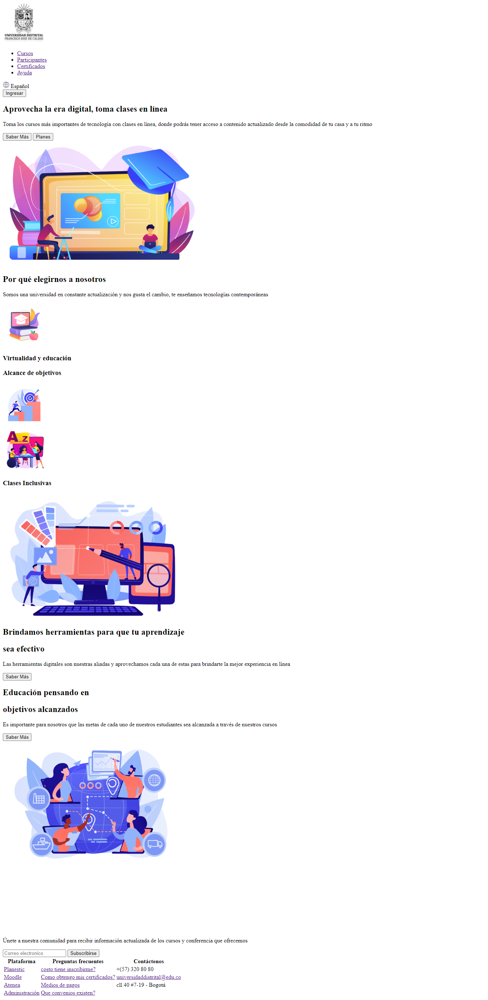

<h1>Taller 9: Paola Bermudez</h1>

<h2>Informacion</h2>

Curso: full Stack Basico - Grupo 1

Profesor: Cristian Patiño

<h2>Punto 1: Link de figma</h2>
<a href="https://www.figma.com/file/BuLTCKihcpBfH8vpqvIwnr/Paola-Bermudez---figma-Excercise?type=design&node-id=9%3A249&t=EtkBdRPT0LA0SB29-1">Link de figma</a>
<h2>Punto: 2 HTML</h2>

